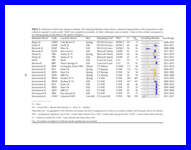
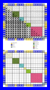
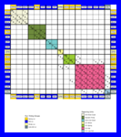
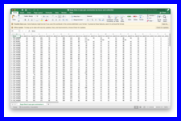
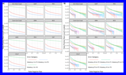
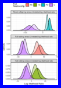
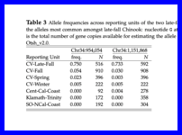
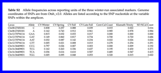
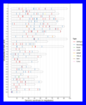
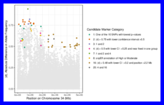

**Last Updated:** `r Sys.Date()`


```{r setup, include=FALSE}
knitr::opts_chunk$set(echo = TRUE)

# use this for the the README.md
GPbase <- "https://eriqande.github.io/california-chinook-microhaps/"

# use this for making the README.html that we will hard link to docs/index.html
Dbase <- "./"

# choose the one that you want here depending on if you are on the
# GitHub README or are making an index.html for the docs directory
hdir <- GPbase

make_link <- function(Rmd, base = hdir) {
  nb <- stringr::str_replace(Rmd, "Rmd$", "html")
  sprintf("%s\n\n(_Compiled RMarkdown HTML document on GitHub Pages:_ [%s](%s%s))\n\n", Rmd, nb, base, nb)
}
```


This repository includes code, data, and some intermediate results to
reproduce the results in Anderson et al. ("A multipurpose microhaplotype
panel for genetic analysis of California Chinook salmon").
You can get the whole thing by cloning or downloading the repo from 
[https://github.com/eriqande/california-chinook-microhaps](https://github.com/eriqande/california-chinook-microhaps).

If you are viewing this as the README of a GitHub repository, note that
you can read it in a somewhat friendlier format on GitHub pages at:
[https://eriqande.github.io/california-chinook-microhaps/](https://eriqande.github.io/california-chinook-microhaps/)

Most of this repository concerns analyses done using R and that are fully contained
within this repo and intended to run automatically to create the figures and
tables used in the paper. 

In most cases, products from cluster computing are placed in this repository within
the `stored_results` directory.  This means that all the RMarkdown documents can be
evaluated successfully without first running the cluster-based analyses.

Analyses requiring cluster computing are documented, but do not run
automatically. 

All the RMarkdown documents can be evaluated en masse using the included
Snakefile which also shows the different output created by each notebook.
Or, if desired, they can be run one at a time in, for example,
RStudio.  Each RMarkdown document creates an HTML file in the docs/
directory that is served up publicly on GitHub pages, so that the
analyses and codes can be read in that context.

On my Mac, it takes about 10 minutes to run all the notebooks, with
002 and 003 being the ones that are most computationally intensive.

# Preliminaries and Dependencies

To the extent possible, we have tried to provide automatic installs of R package
dependencies and some public data sets.  Accordingly, you should be connected
to the internet when you run any of this.  

Running the code here requires the R programming language. It was built most
recently using R 4.4.3.  Presumably any R 4.4.x version will work.  Required R
packages (and their corresponding versions) are managed by `renv`.  If you use
RStudio then you should be prompted to install all the packages upon
opening the project.  

The R code creates publication-ready figures and makes heavy use of the `pdfcrop`
utility.  This utility should be available on your path.  It comes with most TeX
distributions, I believe.  You will need LaTeX to typeset the paper if desired.
Alternatively, you can obtain `pdfcrop` from: 
[https://ctan.org/pkg/pdfcrop?lang=en](https://ctan.org/pkg/pdfcrop?lang=en).

# Evaluating all the R Markdown documents using Snakemake

The `Snakefile` contains a recipe for evaluating all the R Markdown documents.
Within a conda environment that has Snakemake, you can run them all like this:L
```sh
snakemake -np --use-conda --forceall  --cores 8
```
If you are not familiar with Snakemake, it will probably be better to
simply evaluate each one separately within RStudio if you want to 
reproduce the results.  


# RMarkdown Documents

The following RMarkdown documents can be evaluated in any order.


Outputs (figures, tables, etc) from each RMarkdown document
are written to the `tex/images` or `tex/inputs` directories.  Intermediate files
written during evaluation of each RMarkdown document are written
into the `results` directories.


Thumbnails of the figures and tables generated by each RMarkdown document appear
below each notebook that generates them.  

Click the thumbnail to see a full size PDF.

Additionally, at the top of each section is a link to the
compiled (HTML-version) of the RMarkdown document on GitHub Pages.  


## `r make_link("001-map-of-samples.Rmd")`

Makes a map of where the samples were drawn. (Figure 1)

[][fig1]

## `r make_link("002-GSI_and_Fst.Rmd")`

Summaries of the samples and population genetic statistics,
as well as GSI power analysis and Fst calculation.
(Tables 1, 4;  Figures 2, S4 S6, S7; SuppData 2)


[][tab1]
[][tab4]

[][fig2]
[][figS4]
[][figS6]
[][figS7]


[][supp_data2]


## `r make_link("003-ckmr-sim-evaluation.Rmd")`

Using CKMRsim to estimate false positive rates and false negative rates
of relationship inference.  Also comparisons of power for inferring relatives
when using microhaplotypes versus single SNPs from each amplicon.
(Figures 4, 5, S8)

[][fig4]
[][figS8]
[][fig5]

## `r make_link("004-lfar-and-wrap-allele-freqs.Rmd")`

Assessing allele frequency differences between groups of fish at the
LFAR and WRAP amplicons. (Tables 3, S2)

[][tab3]
[][tabS2]

## `r make_link("005-plotting-genome-locations-of-markers.Rmd")`

Plotting the positions of different amplicons in the genome.
(Figure S1)

[][figS1]

## `r make_link("006-winter-run-vs-all-cv-alle-freqs.Rmd")`

Analyzing the allele frequencies from WGS data to identify regions
that show large allele frequency differences between winter run
and everyone else to discover the WRAP markers. (Figures S9, S10, S11)

[][figS9]
[][figS10]
[][figS11]


## `r make_link("007-whoa-on-chinook.Rmd")`

This was not included in the paper, but is an interesting analysis of
the markers suggesting that two of them might have some genotyping
issues and would be good candidates for removal in a further update
to the baseline.

[][whoa]


## `r make_link("008-lfar-gwas-and-markers.Rmd")`

Analyzing the GWAS and allele frequency data from the LFAR search. (Figures S2, S3).

[][figS2]
[][figS3]


## `r make_link("009-structure.Rmd")`

Running _structure_ analyses on the data set. (Figures 3, S5).

[][fig3]
[][figS5]


# Repo Contents

The most important data in this repository are in:

- `data/SWFSC-chinook-reference-baseline.csv.gz`: The actual reference data set---genotypes
of all the fish in the baseline.
- `data/baseline_repository_meta_complete.csv.gz`: Metadata from all those reference
data set fish

The rest of the repo is involved in analyses of those data sets.  
Here is a an annotated graphical overview of the contents of the
repo made using `tree`.   Some file-series are omitted and replaced with
ellipses, and this is not guaranteed to be current, but it gives
a clear picture of the main parts of the repo.

```sh
.
├── .Rprofile                                             # For initiating renv
├── .gitignore                                            # standard git ignore file
├── 001-map-of-samples.Rmd                                # 8 Rmarkdown documents (where the analyses happen)
├── 002-GSI_and_Fst.Rmd                                  
├── 003-ckmr-sim-evaluation.Rmd
├── 004-lfar-and-wrap-allele-freqs.Rmd
├── 005-plotting-genome-locations-of-markers.Rmd
├── 006-winter-run-vs-all-cv-alle-freqs.Rmd
├── 007-whoa-on-chinook.Rmd
├── 008-lfar-gwas-and-markers.Rmd
├── R                                                     # Directory of R code that gets sourced and reused in the notebooks
│   ├── colors.R
│   ├── get_top_assignments.R
│   ├── manhattan_plot_funcs.R
│   ├── month_sample_sparkline.R
│   ├── plot_self_assigment_table.R
│   ├── shift_legend.R
│   ├── table-as-figure.R
│   └── taf-prep.R
├── README.Rmd                                            # Source for README and docs/index
├── README.md                                             # Produced from README.Rmd
├── Snakefile                                             # Snakefile to run all R notebooks
├── SnakemakeSubDirs                                      # Copies of other repos used for cluster-based analyses
│   └── cga-late-fall-bam-assoc                           # LFAR GWAS using angsd code uses Snakemake
│       ├── .gitignore
│       ├── README.Rmd
│       ├── Snakefile                                     # This has all the info on how to run the LFAR/GWAS analysis
│       ├── cga-late-fall-bam-assoc.Rproj
│       ├── envs
│       │   ├── angsd.yaml
│       │   └── samtools.yaml
│       ├── inputs
│       │   ├── lf_v_both.bamlist
│       │   ├── lf_v_both.ybin
│       │   ├── lf_v_frhf.bamlist
│       │   ├── lf_v_frhf.ybin
│       │   ├── lf_v_sanjo.bamlist
│       │   ├── lf_v_sanjo.ybin
│       │   ├── region_files
│       │   │   ├── unplaced-001.txt
│       │   │   ├── unplaced-002.txt
│       │   │   ├── ...
│       │   │   ├── unplaced-027.txt
│       │   │   └── unplaced-028.txt
│       │   └── scaffold_groups.tsv
│       ├── scripts
│       │   ├── manhattan-plot.R                          # Functions for making manhattan plots
│       │   └── prep
│       │       └── make-scaff-beds.R
│       └── sedna                                         # cluster profile for Snakemake
│           ├── config.yaml
│           └── status-sacct.sh
├── california-chinook-microhaps.Rproj                    # Rstudio project file
├── data                                                  # Main data files
│   ├── SWFSC-chinook-reference-baseline.csv.gz           # The actual reference data set
│   └── baseline_repository_meta_complete.csv.gz          # Meta data for all fish in reference data set
├── development                                           # Folder of various things that we ended up not using
│   ├── genepop-conversion.Rmd
│   └── genepop-conversion.nb.html
├── docs                                                  # Directory of html files served up on GitHub Pages
│   ├── 001-map-of-samples.html
│   ├── 002-GSI_and_Fst.html
│   ├── 003-ckmr-sim-evaluation.html
│   ├── 004-lfar-and-wrap-allele-freqs.html
│   ├── 005-plotting-genome-locations-of-markers.html
│   ├── 006-winter-run-vs-all-cv-alle-freqs.html
│   ├── 007-whoa-on-chinook.html
│   └── 008-lfar-gwas-and-markers.html
├── envs                                                  # YAMLS specifying conda environments for snakemake rules
│   └── pandoc.yaml
├── extras                                                # Scripts and code used in cleaning/standardizing the baseline prior to distribution 
│   ├── .gitignore
│   ├── Applying-New-Names-To-Baseline
│   │   ├── .gitignore
│   │   ├── applying-new-names-to-baseline.Rmd
│   │   ├── subRoSA_baseline_rubias_JUN2024_w_mixture_complete-rosa_lfar_vgll3six6_added.csv
│   │   └── subRoSA_baseline_rubias_with_rosa_wrap_lfar_vgll3six6_and_mixture_28JUN2024.csv
│   ├── Renaming-amplicons
│   │   ├── .gitignore
│   │   ├── Amplicon-renaming.Rmd
│   │   ├── ChinookFullPanelLociTable_May2024Updated.xlsx
│   │   ├── Otsh_v2.0_chroms.tsv
│   │   └── add-species-id.Rmd
│   └── Reordering-forward-and-reverse-primers
│       ├── OLD-Calif-Chinook-Amplicon-Panel-Information.csv
│       └── primer-pair-reorder.R
├── inputs                                                 # Small inputs used in most R notebooks
│   ├── Calif-Chinook-Amplicon-Panel-Information.csv
│   ├── Otsh_v1.0_chrom_lengths.tsv
│   ├── Otsh_v2.0_chrom_lengths.tsv
│   ├── Rivers_OR
│   │   ├── Rivers_OR.dbf
│   │   ├── Rivers_OR.prj
│   │   ├── Rivers_OR.sbn
│   │   ├── Rivers_OR.sbx
│   │   ├── Rivers_OR.shp
│   │   └── Rivers_OR.shx
│   ├── map-notations.tsv
│   ├── reference-collection-names.csv
│   └── wrap
│       └── chrom_lengths.txt
├── renv                                                   # Folder of renv R package management stuff 
│   ├── .gitignore
│   ├── activate.R
│   └── settings.json
├── renv.lock                                              # renv R package management lockfile
├── scripts                                                # Scripts used when running Snakemake or prepping the Snakefile
│   ├── R_input_and_output_lists_to_snakemake_skeleton.sh
│   └── render-rmd-for-snakemake.R
├── stored_results                                         # Results produced on the HPCC stored here for further analysis
│   ├── 5Mb_Chr34-cv-fall.mafs.gz
│   ├── 5Mb_Chr34-late-fall.mafs.gz
│   ├── lfar-gwas
│   │   ├── lf_v_frhf-NC_037130.1.lrt0.gz
│   │   └── lf_v_sanjo-NC_037130.1.lrt0.gz
│   ├── stored_p_vals.rds
│   ├── thompson2020-vcf
│   │   ├── ots34-5Mb-snpEff.vcf.gz
│   │   └── ots34-5Mb-snpEff.vcf.gz.csi
│   └── win-non-win-abs-diffs-gt0.5.rds
└── tex                                                    # Directory of files for typesetting the manuscript
    ├── .gitignore
    ├── GitLatexDiffIt.sh
    ├── abstract.tex
    ├── author-title-etc.tex
    ├── body-text-of-paper.tex
    ├── citation.bib
    ├── data-accessibility.tex
    ├── eca_molecolres.sty
    ├── images                                             # Figures/images included in manuscript.  Many (but not all) are produced when running the notebooks
    │   ├── Fall-run-ball-crop.pdf
    │   ├── Late-fall-run-ball-crop.pdf
    │   ├── Spring-run-ball-crop.pdf
    │   ├── Winter-run-ball-crop.pdf
    │   ├── ass-table-80-crop.pdf
    │   ├── banner.pdf
    │   ├── ckmr-comp-figure-crop.pdf
    │   ├── clumpak-crop.pdf
    │   ├── fpr-fnr-figure-crop.pdf
    │   ├── frh-comp-figure-crop.pdf
    │   ├── genomic-locations-plot.pdf
    │   ├── gsi_and_fst_fig-crop.pdf
    │   ├── lfar-assoc-faceted-min-0.png
    │   ├── lfar-candidates.pdf
    │   ├── major-modes-crop.pdf
    │   ├── map-crop.pdf
    │   ├── minor-modes-crop.pdf
    │   ├── months-BCF_Butte-Creek.pdf
    │   ├── months-BCS_Butte-Creek.pdf
    │   ├── months-BCkF_Blue-Creek.pdf
    │   ├── months-CHLF_Coleman-National-Fish-Hatchery.pdf
    │   ├── months-CRHS_Cole-Rivers-Hatchery.pdf
    │   ├── months-CoRHS_Cole-Rivers-Hatchery.pdf
    │   ├── months-ERF_Van-Arsdale-Fisheries-Station.pdf
    │   ├── months-FRHF_Feather-River-Hatchery.pdf
    │   ├── months-FRHS_Feather-River-Hatchery.pdf
    │   ├── months-IGHF_Iron-Gate-Hatchery.pdf
    │   ├── months-MDF_Deer-Creek.pdf
    │   ├── months-MDF_Mill-Creek.pdf
    │   ├── months-MDS_Deer-Creek.pdf
    │   ├── months-MDS_Mill-Creek.pdf
    │   ├── months-RRF_Warm-Springs-Hatchery.pdf
    │   ├── months-SJRF_San-Joaquin-River.pdf
    │   ├── months-SRW_Livingston-Stone-National-Fish-Hatchery.pdf
    │   ├── months-SmRF_Smith-River.pdf
    │   ├── months-TRF_Trinity-River-Hatchery.pdf
    │   ├── months-TRS_Trinity-River-Hatchery.pdf
    │   ├── num-alle-barplot.pdf
    │   ├── rosa-gsi-table-crop.pdf
    │   ├── winter-v-non-winter-mh-plot_nind_ge10.pdf
    │   ├── wrap-candi.pdf
    │   └── wrap-slide-window.pdf
    ├── inputs                                              # LaTeX input for tables in manuscripts. Many (but not all) are produced when running the notebooks
    │   ├── amplicon-summary.tex
    │   ├── ascertainment-samples-supp-table.tex
    │   ├── lfar-freqs.tex
    │   ├── popgen-summary.tex
    │   ├── samples-table.tex
    │   └── wrap-freqs.tex
    ├── main-one-col.tex                                   # Main TeX document for one-column format typesetting (for submission)
    ├── main.bbl
    ├── main.tex                                           # Main TeX document for two-column format typesetting
    ├── men.bst
    ├── newcomms.tex
    ├── responses-to-referees
    │   ├── .gitignore
    │   └── responses-to-reviewers-1.Rmd
    ├── supp_data                                          # Supplemental data
    │   ├── Supp-Data-1-Amplicon-info.csv
    │   └── Supp-Data-2-pop-gen-summaries-by-locus-and-collection.csv
    ├── supplement.bbl
    ├── supplement.tex                                    # Main TeX document for typesetting the supplement
    ├── supplemental-figures.tex
    ├── supplemental-tables.tex
    └── supplemental-text.tex

```


[fig1]: `r hdir`images_and_thumbs/figure1.pdf
[tab1]: `r hdir`images_and_thumbs/table1.pdf
[fig2]: `r hdir`images_and_thumbs/figure2.pdf
[figS4]: `r hdir`images_and_thumbs/figureS4.pdf
[figS6]: `r hdir`images_and_thumbs/figureS6.pdf
[figS7]: `r hdir`images_and_thumbs/figureS7.pdf
[supp_data2]: `r hdir`images_and_thumbs/Supp-Data-2-pop-gen-summaries-by-locus-and-collection.csv
[tab4]: `r hdir`images_and_thumbs/table4.pdf
[fig4]: `r hdir`images_and_thumbs/figure4.pdf
[figS8]: `r hdir`images_and_thumbs/figureS8.pdf
[fig5]: `r hdir`images_and_thumbs/figure5.pdf
[tab3]: `r hdir`images_and_thumbs/table3.pdf
[tabS2]: `r hdir`images_and_thumbs/tableS2.pdf
[figS1]: `r hdir`images_and_thumbs/figureS1.pdf
[figS9]: `r hdir`images_and_thumbs/figureS9.pdf
[figS10]: `r hdir`images_and_thumbs/figureS10.pdf
[figS11]: `r hdir`images_and_thumbs/figureS11.pdf
[whoa]: `r hdir`images_and_thumbs/whoa.pdf
[figS2]: `r hdir`images_and_thumbs/figureS2.png
[figS3]: `r hdir`images_and_thumbs/figureS3.pdf
[fig3]: `r hdir`images_and_thumbs/figure3.pdf
[figS5]: `r hdir`images_and_thumbs/figureS5.pdf
